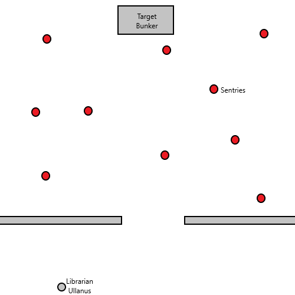

# Battle for Masali
## Mission 1 - Infiltration

### Background
The forces of Nurgle are trying to infiltrate the Masali system. To do this they must reach a command bunker on Star Fort Eucladus and disable its void shields, allowing the invasion to begin.

To allow them access to the fort, agents of the Death Guard have unknowingly infected librarian Petronius Ullanus with spores of the Cyclospora Septa. This has given the Death Guard control of the actions of the librarian, and a path into the Masali system...

### Setup
This mission is played on a 4x4 board.

